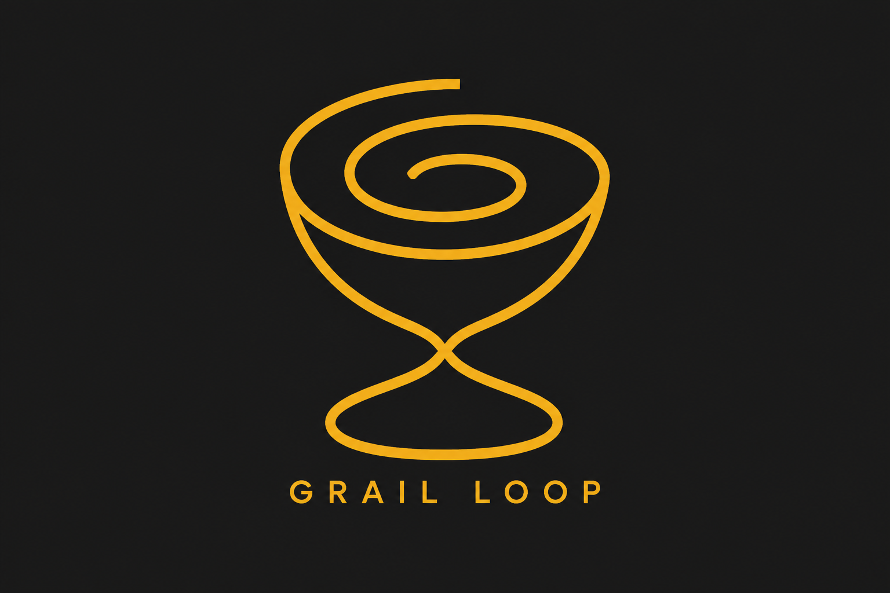

<p align="center">
  
</p>

<p align="center"><em>A machine-verified floor, an unreachable ceiling, and an honest stop.</em></p>

---

**Grail Loop** is an autonomous build methodology for coding agents. Point it at a game, an app, a site, or a design piece. It writes a machine-checkable definition of done before building anything, then builds in cycles while fresh cold-context critics blind-compare every cycle's output against master references it can never match (real film stills, shipped AAA frames, category-defining product UI). The pursuit of an unreachable bar is what forges the quality. Telemetry, not vibes, decides when the run ends.

Ships as a [Claude Code](https://code.claude.com) skill: one `SKILL.md` router plus eight on-demand reference files.

## Quickstart

```bash
git clone https://github.com/ricardojustus/grail-loop ~/.claude/skills/grail-loop
```

Then, in Claude Code:

```
/grail <what you want built>                 the agent picks mode and domain
/grail asymptotic game <one-shot prompt>     full quality pursuit
/grail bounded <task>                        rigor only, real finish line
/grail asymptotic app ./VISION.md            you own design, agent owns execution
```

You can name quality bars ("at the level of X") and a style ("in the vein of Y"), or leave both to the agent.

## Writing an asymptotic request

The run works from one prompt. The shape matters more than the length:

1. **Concept**: everything that makes it THIS thing, nothing about how. Include every load-bearing mechanic; leave implementation free.
2. **Scope bound**: one concrete boundary ("one ship, one expedition", "one core journey, three screens"). A bound creates the shape; it does not shrink the ambition.
3. **Direction** (optional): a style vocabulary to imitate, "in the vein of Dead Space's diegetic interfaces". This is a starting language, never a judge.
4. **Bars** (optional): unreachable masters to be judged against, "at the level of Alien: Isolation's atmosphere". One master per quality dimension. If you skip this, the agent selects bars and logs its reasoning in DECISIONS.md.

Everything else (the story beats, the layout, the UI) is the agent's to invent. That delegation is where the one-shot surprise lives.

Example, full shape:

> /grail asymptotic game "Build DRIFTWAKE: a lone salvager boards a derelict colony ship adrift in a nebula, restoring power deck by deck to reach the bridge and learn why the crew vanished. Every restored system changes how the ship behaves (lights, doors, gravity) and something aboard responds to the power coming back. One ship, story resolves in a single expedition across 6-8 decks. In the vein of Dead Space's diegetic interfaces. At the AAA quality level of Alien: Isolation's dread and atmosphere and The Last of Us Part II's environmental storytelling."

## Choosing references: high, clear, unreachable

The bar set is the highest-leverage decision you can make. Three rules:

- **Unreachable by default.** Every bar must be something the output will lose to for the entire run. The pursuit of a bar it cannot catch is the quality engine; a catchable bar is an exit door, and the run will find it. If the agent could plausibly tie your reference, it is a direction ("in the vein of"), never a bar.
- **High means master-tier.** Shipped AAA frames, real film cinematography, category-defining product UI. Film stills are the strongest visual bar per token that exists: no game render outshoots a hundred-million-dollar cinematographer.
- **Clear means inspectable.** A bar only works if a critic can hold a concrete artifact of it next to your output: a frame, a screenshot, a captured flow. "Nintendo-quality polish" is a wish; "God of War Ragnarök's one-shot camera through combat" is a bar. Name the dimension each bar judges.

Your own captures from products you own usually beat press shots: real gameplay frames at the angles your output will actually produce. The skill asks once at launch whether you want to supply them.

## Why it exists

The Grail Loop is Ricardo Justus's synthesis of three ancestors, each with a defect the others fix:

1. **The Ralph Loop**: run until externally validated. Simple, but nothing defines "validated."
2. **Matt Shumer's [Gauntlet Loop](https://github.com/mshumer/Claude-of-Duty)** (the prompting method behind Claude of Duty): builder sub-agents fan out while a harsh fresh critic blind-compares screenshots against real Call of Duty footage, never approving. The unreachable bar is the engine, and it produces startling quality. But it is unfalsifiable (beautiful screenshots can hide a secretly broken product) and it has no honest stop: the human is the brake.
3. **A contract-first build methodology** Ricardo had already used before the gauntlet had a name: machine-checkable completion criteria, destructive testing, "it should work" is not evidence. An earlier, weaker version of this loop one-shotted a full production app in 22 hours. But a contract alone stops exactly at spec and never enters the quality-squeezing phase.

The synthesis: **floor and ceiling simultaneously, plus the telemetry that replaces the human brake.**

## The two layers

| Layer | Question it answers | Mechanism |
|---|---|---|
| **The Contract** (floor) | Is this allowed to ship? | Machine-verified criteria, written before any building. Binary, evidence-based, must reach 100%. Destructive tests included. |
| **The ceiling** | How good is it when it ships? | Per-dimension master references, compared blind by fresh cold critics every cycle. Asymptotic by design: the comparison keeps failing, and the margin data is the point. |

Two modes: **bounded** (Contract only, for work with a real finish line) and **asymptotic** (Contract plus ceiling, for anything with a quality dimension worth chasing).

## The instruments

Fresh critics cannot calibrate absolute scores across rounds (every fresh judge invents its own meaning of "6/10"), so critics emit only pairwise verdicts and deltas. The run's memory lives in a ledger, never in the critics:

- **Champion vs challenger** (the odometer): each cycle blind-compared against the best cycle so far, signed margin from -3 to +3. Measures whether the run moved.
- **Master A/B** (altitude): per-dimension blind deltas against the reference masters. Measures which way is up.
- **Deficiency ledger**: every complaint classified new / repeat / reintroduced, with fix attempts counted. A twice-attacked survivor reported by critics who never met each other is a wall, and the map of walls ships in the final report as a first-class deliverable: where the model's ceiling actually sits.

## What a cycle looks like

One critic verdict, in the ledger's shape (illustrative):

```text
CYCLE 4: champion vs challenger: +1 (challenger, narrowly)
MASTER A/B vs Alien: Isolation frame 07 (corridor atmosphere): master
wins, NARROWLY.
  - emergency lighting flattens to uniform red past 10m (repeat, attempt 2)
  - fog volume clips against bulkhead geometry (new)
vs The Last of Us Part II (environmental storytelling): master wins,
decisively.
```

## The honest stop

Every asymptotic pursuit eventually hits diminishing returns: the early cycles are the steep part of the curve, and past some point each cycle buys less improvement than the last, while "it's still improving" remains technically true forever, because that is what an asymptote is. A run that stops on its own satisfaction stops too early; a run that stops when improvement ends never stops at all. So the stop was designed around the one thing that does change: the rate of approach. The telemetry watches for the flattening (margins stalling, dimension wins drying up, critics repeating themselves) and ends the run when the tokens stop converting into quality, not when the quality stops being imperfect. An unreachable bar with no such brake is just a token furnace.

The run ends only by explicit rule:

1. **Plateau declared**: 2 of 3 stall tests hold over a 3-cycle window (margin stall, altitude stall, criticism exhaustion). Declaration triggers one structural gambit at the top persistent deficiency; a decisive win resets the window, anything less finalizes.
2. **Oscillation**: the same deficiency reintroduced twice (fixed, broken, fixed, broken). Immediate declaration, the loop is chasing its tail.
3. **The human says stop**, anytime.

There is deliberately no codified budget cap: a cap amputates exactly the long-tail cycles the pursuit exists for. Instead, the skill will not start without an explicit GO (see below), and you can name a spend constraint at any moment.

## Cost: read this before running

**A Grail Run is a deliberate, heavy token spend.** Asymptotic mode runs cycles of builder fan-outs and multi-critic reviews, potentially for hours. That spend is the price of very high quality output in one autonomous shot. The skill states this and asks for your explicit GO at launch, plus one question about the sub-agent model (the launch gate names its current default and asks before starting, so this README never goes stale on model names). No GO, no run.

## Reference images and copyright

Master references (film stills, game frames, product captures) are downloaded to a local, gitignored `refs/` folder, used solely for private, transient comparative evaluation during the run, never distributed or committed, and deleted as the run's final action. Keep it that way.

## What is in the box

```
SKILL.md                    the router: modes, launch gate, loop, stop rules
references/contract.md      writing and verifying the machine-checked floor
references/critics.md       cold-read protocol, blind comparisons, the ledger
references/plateau.md       stall tests, the gambit, finalization
references/bars.md          choosing unreachable masters; direction vs bar
references/games.md         domain pack: games
references/apps.md          domain pack: apps and sites
references/design.md        domain pack: static design work
references/templates.md     CONTRACT, LEDGER, FINAL_REPORT skeletons
```

## FAQ

**Will it ever pass the master comparison?**
No. That is the design, not the defect. See "The honest stop": the run ends by telemetry, and the gap it could not close ships as a deliverable.

**Can I supply my own reference images?**
Yes, and you probably should: captures from products you own, at the angles your output will produce, beat press shots. The skill asks once at launch.

**How much will this cost?**
Deliberately uncapped: a hard cap amputates the long-tail cycles the pursuit exists for. The GO gate means you never spend it by accident, and the gentlest constraint to name at launch is max cycles, since it never cuts a cycle in half.

## Ran a grail run?

PR your FINAL_REPORT.md and three captures (first cycle, last cycle, one master ref side-by-side) into [/gallery](gallery/).

## License

MIT. See [LICENSE](LICENSE).

Credit where due: the unreachable-bar insight belongs to Matt Shumer's Gauntlet Loop. The floor, the instruments, and the honest stop are what this project adds.
